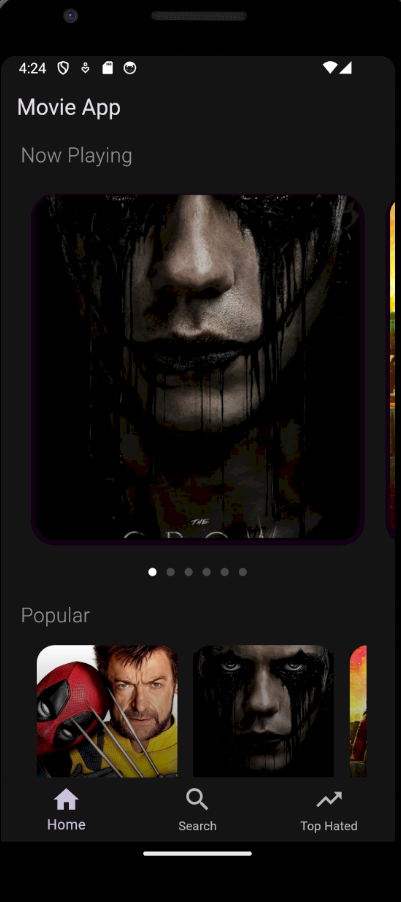
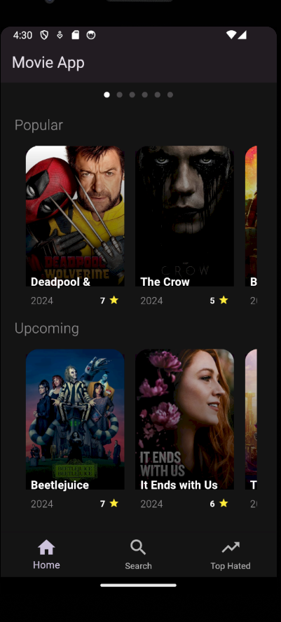
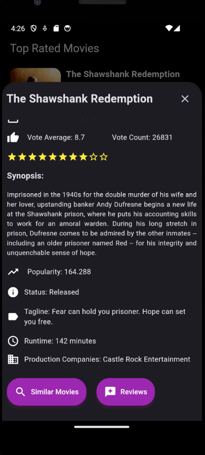
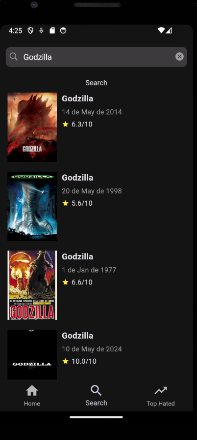
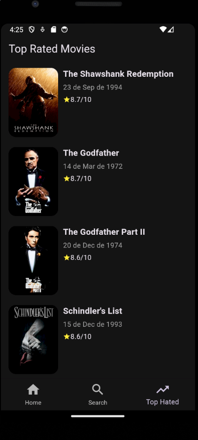
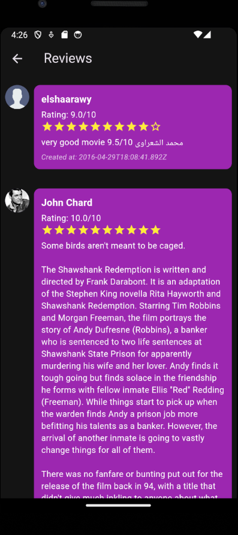
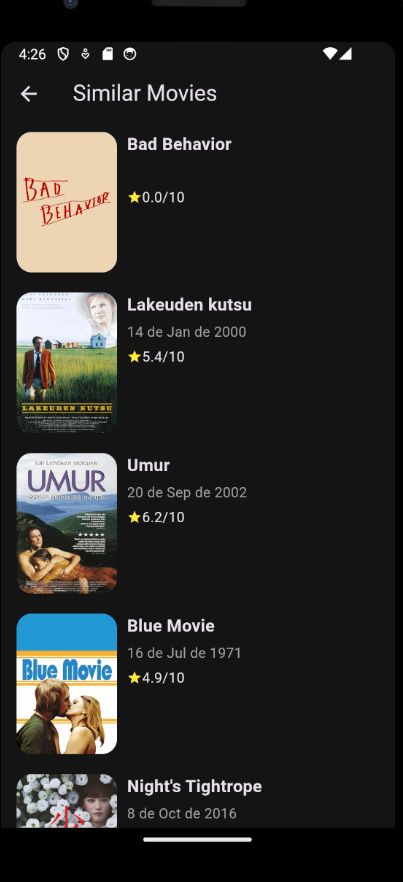

# Movie App

## Descrição

O **Movie App** é um aplicativo incrível que permite aos usuários explorar uma vasta biblioteca de filmes. Com ele, você pode:
- Ver detalhes dos filmes.
- Buscar por filmes específicos.
- Procurar filmes similares.
- Ler reviews de filmes.

## Funcionalidades

- **Detalhes do Filme**: Veja informações detalhadas sobre qualquer filme.
- **Buscar Filme**: Realize buscas personalizadas para encontrar exatamente o que você deseja assistir.
- **Filmes Similares**: Descubra filmes similares aos que você gostou.
- **Reviews**: Leia análises e reviews de outros usuários sobre os filmes.

## Como Usar

1. Clone o repositório:
    ```bash
    git clone https://github.com/seu-usuario/movie-app.git
    ```
2. Navegue até o diretório do projeto:
    ```bash
    cd MovieApp
    ```
3. Instale as dependências:
    ```bash
    flutter pub get
    ```
4. Execute o aplicativo:
    ```bash
    flutter run
    ```

## Estrutura do Código

- **HomePage**: A página principal que exibe as categorias de filmes como "Now Playing", "Popular" e "Upcoming".
- **ApiServices**: Classe responsável por fazer as chamadas à API e fornecer os dados dos filmes.
- **TopRatedPage**: Página que exibe uma lista dos filmes mais bem avaliados (Top Rated).
- **search_page.**: Página que para buscar um filme específico com base no nome.
  
## API Utilizada

Este aplicativo utiliza a [The Movie Database (TMDb) API](https://www.themoviedb.org/documentation/api) para buscar informações sobre filmes. Certifique-se de obter a sua própria API key e configurar no aplicativo.

## Exemplos

### Tela Principal



### Detalhes do Filme



### Busca de Filme


### Top Rated Movies


### Reviews


### Similar Movies

